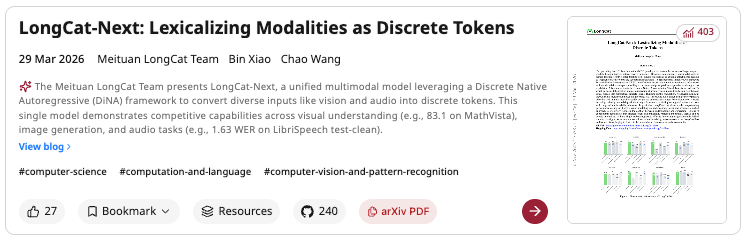

# Papers arXiv Copy

A Chrome extension that adds **one-click arXiv link copy buttons** to [HuggingFace Daily Papers](https://huggingface.co/papers) and [alphaXiv](https://www.alphaxiv.org/) pages.

## Features

- **HuggingFace Papers**: Adds an `arXiv` badge on each paper's thumbnail. Click the badge to copy the `arxiv.org/abs/` link to your clipboard.
- **alphaXiv**: Adds an `arXiv PDF` pill button in each paper card's action bar. Click to copy the `arxiv.org/pdf/` link.
- Visual feedback: button turns green and shows "Copied!" on success.
- Automatically handles dynamically loaded content via MutationObserver.

## Screenshots

| HuggingFace Daily Papers | alphaXiv |
|:---:|:---:|
|  |  |

## Installation

1. Clone or download this repository.
2. Open Chrome and navigate to `chrome://extensions/`.
3. Enable **Developer mode** (top-right toggle).
4. Click **Load unpacked** and select the extension folder.

## File Structure

```
├── manifest.json   # Extension manifest (Manifest V3)
├── content.js      # Core logic: injects copy buttons on matched pages
├── style.css       # Styles for the arXiv badge and pill button
├── asset/          # Screenshots
│   ├── huggingface.png
│   └── alphaxiv.png
└── README.md
```

## Usage

After installation, simply visit:

- `https://huggingface.co/papers` — an arXiv badge appears on each paper thumbnail.
- `https://www.alphaxiv.org/` — an arXiv PDF button appears in each paper card's action bar.

Click the button to copy the corresponding arXiv link to your clipboard.

## Permissions

- `clipboardWrite` — required to copy links to the clipboard.
