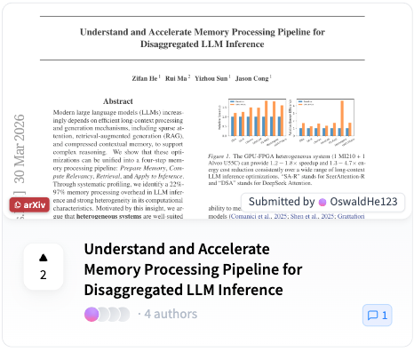

# Papers arXiv Copy

一款 Chrome 浏览器扩展，为 [HuggingFace Daily Papers](https://huggingface.co/papers) 和 [alphaXiv](https://www.alphaxiv.org/) 页面添加一键复制 arXiv 链接的按钮，方便快速获取论文原始链接。

## 功能

- **HuggingFace Papers**：在每篇论文缩略图上叠加红色 `arXiv PDF` 徽章按钮，点击即复制对应的 `arxiv.org/pdf/...` 链接到剪贴板，同时将缩略图链接替换为 arXiv PDF 页面。通过 HuggingFace 论文链接直接进行字符串替换推断 arXiv ID，无需访问详情页。
- **alphaXiv**：在论文卡片底部操作栏添加 `arXiv PDF` 药丸按钮，点击即复制 `arxiv.org/pdf/...` 链接。
- 点击后按钮短暂变为绿色 "Copied!" 反馈，1.5 秒后自动恢复。
- 支持页面动态加载（MutationObserver 监听），无需手动刷新。

## 效果展示

**HuggingFace Daily Papers 页面：**



**alphaXiv 页面：**


## 安装

1. 下载或克隆本仓库
2. 打开 Chrome，进入 `chrome://extensions/`
3. 开启右上角**开发者模式**
4. 点击**加载已解压的扩展程序**，选择本项目文件夹

## 文件结构

```
├── manifest.json   # 扩展配置 (Manifest V3)
├── content.js      # 内容脚本，注入复制按钮逻辑
├── style.css       # arXiv 徽章与药丸按钮样式
├── asset/          # 截图资源
│   ├── huggingface_daily.png
│   └── alphaxiv.png
└── README.md
```

## 使用方式

安装后，直接访问以下页面即可：

- `https://huggingface.co/papers` — 每篇论文缩略图上出现 arXiv 徽章，点击复制链接。
- `https://www.alphaxiv.org/` — 每张论文卡片操作栏出现 arXiv PDF 按钮，点击复制链接。

## 权限说明

本扩展仅请求 `clipboardWrite` 权限，用于将链接写入剪贴板，不收集任何用户数据。
